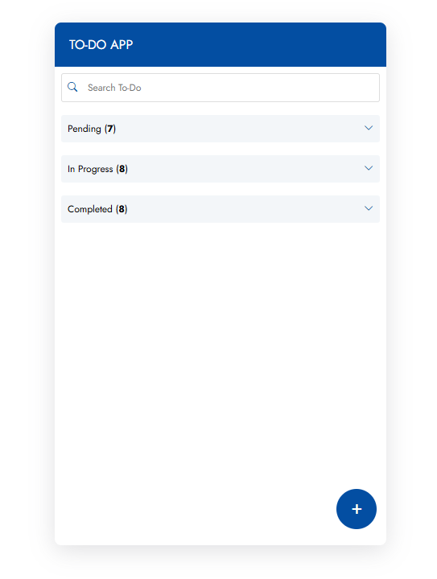
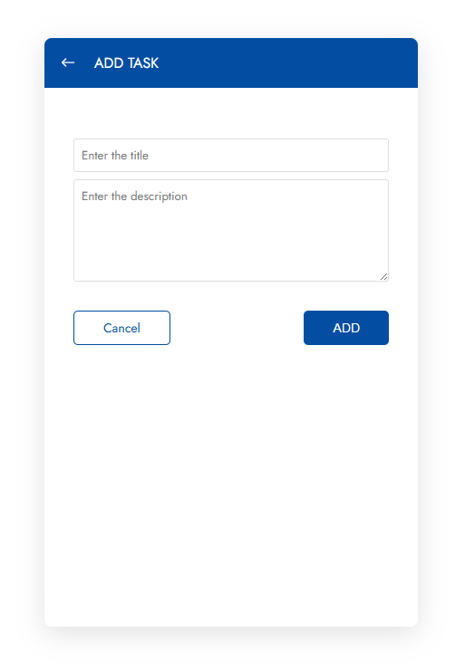
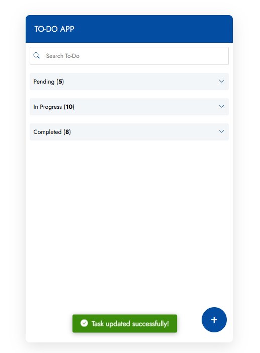
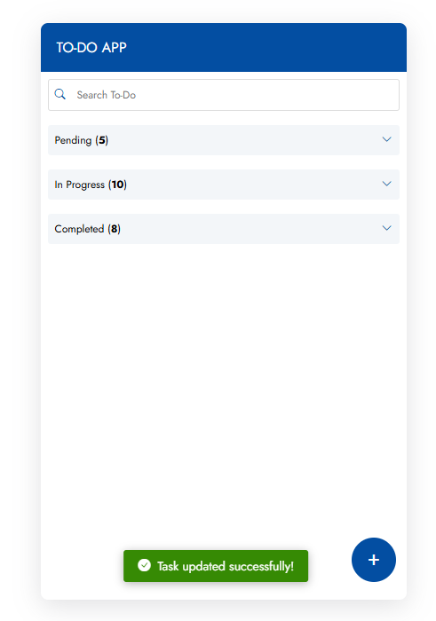

# Task Management Tool

Simple Task Management Tool where user can manage their task. This tool saves task in localStorage which preserve the task even on refresh of the page.

Please follow steps to run the project

- Open Terminal/Command Prompt/Shell in the current project

- Install all the packages by running `npm install` command
```
npm install
```

- Run the project in development project
```
npm run dev
```

- Build the project for production environement
```
npm run build
npm run preview
```

Some of the screenshot of the app.

1. Main Screen\


2. Adding Task to the App\


3. Success message on adding Task to the App\


4. Visible Edit and delete button on hovering task page\


5. Edit Task Page\


6. Success message on editing the task\
